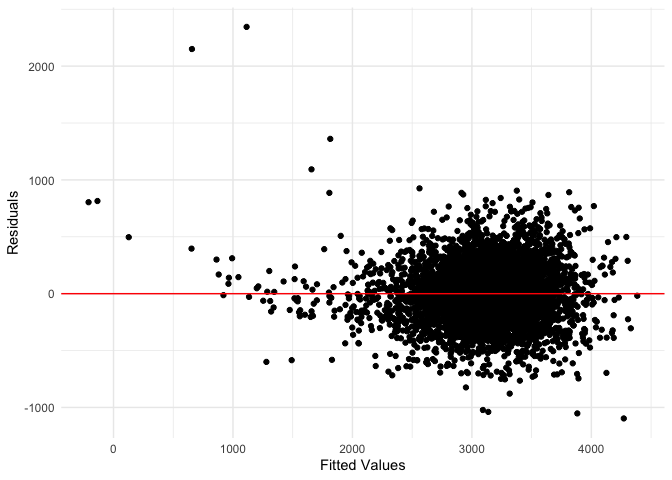

p8105_hw6_zj2379
================
Zheshu Jiang
2023-11-28

# Problem 0

``` r
weather_df = 
  rnoaa::meteo_pull_monitors(
    c("USW00094728"),
    var = c("PRCP", "TMIN", "TMAX"), 
    date_min = "2022-01-01",
    date_max = "2022-12-31") |>
  mutate(
    name = recode(id, USW00094728 = "CentralPark_NY"),
    tmin = tmin / 10,
    tmax = tmax / 10) |>
  select(name, id, everything())
```

    ## using cached file: /Users/jiangzheshu/Library/Caches/org.R-project.R/R/rnoaa/noaa_ghcnd/USW00094728.dly

    ## date created (size, mb): 2023-10-02 00:33:00.465025 (8.525)

    ## file min/max dates: 1869-01-01 / 2023-09-30

# Problem 1

``` r
homicide_df = 
  read_csv("homicide-data.csv", na = c("", "NA", "Unknown")) |> 
  mutate(
    city_state = str_c(city, state, sep = ", "),
    resolution = case_when(
      disposition == "Closed without arrest" ~ 0,
      disposition == "Open/No arrest"        ~ 0,
      disposition == "Closed by arrest"      ~ 1),
    victim_age = as.numeric(victim_age))|>
  filter(victim_race == "Black" | victim_race == "White")|> 
  filter(!(city_state %in% c("Tulsa, AL", "Dallas, TX", "Phoenix, AZ", "Kansas City, MO"))) |> 
  select(city_state, resolution, victim_age, victim_sex, victim_race)
```

    ## Rows: 52179 Columns: 12
    ## ── Column specification ────────────────────────────────────────────────────────
    ## Delimiter: ","
    ## chr (8): uid, victim_last, victim_first, victim_race, victim_sex, city, stat...
    ## dbl (4): reported_date, victim_age, lat, lon
    ## 
    ## ℹ Use `spec()` to retrieve the full column specification for this data.
    ## ℹ Specify the column types or set `show_col_types = FALSE` to quiet this message.

Save the output of glm as an R object; apply the broom::tidy to this
object; and obtain the estimate and confidence interval of the adjusted
odds ratio for solving homicides comparing male victims to female
victims keeping all other variables fixed.

``` r
baltimore_data= homicide_df |> filter(city_state=="Baltimore, MD")|>
  glm(resolution ~ victim_age + victim_sex + victim_race, family = binomial(), data = _)

baltimore_data |> 
  broom::tidy() |> 
  mutate(
    OR = exp(estimate), 
    OR_CI_upper = exp(estimate + 1.96 * std.error),
    OR_CI_lower = exp(estimate - 1.96 * std.error)) |> 
  filter(term == "victim_sexMale") |> 
  select(OR, OR_CI_lower, OR_CI_upper) |>
  knitr::kable(digits = 3)
```

|    OR | OR_CI_lower | OR_CI_upper |
|------:|------------:|------------:|
| 0.426 |       0.325 |       0.558 |

Now run glm for each of the cities in your dataset, and extract the
adjusted odds ratio (and CI) for solving homicides comparing male
victims to female victims. Do this within a “tidy” pipeline, making use
of purrr::map, list columns, and unnest as necessary to create a
dataframe with estimated ORs and CIs for each city.

``` r
model_results = 
  homicide_df |> 
  nest(data = -city_state) |> 
  mutate(
    models = map(data, \(df) glm(resolution ~ victim_age + victim_sex + victim_race, 
                             family = binomial(), data = df)),
    tidy_models = map(models, broom::tidy)) |> 
  select(-models, -data) |> 
  unnest(cols = tidy_models) |> 
  mutate(
    OR = exp(estimate), 
    OR_CI_upper = exp(estimate + 1.96 * std.error),
    OR_CI_lower = exp(estimate - 1.96 * std.error)) |> 
  filter(term == "victim_sexMale") |> 
  select(city_state, OR, OR_CI_lower, OR_CI_upper)

model_results |>
  slice(1:5) |> 
  knitr::kable(digits = 3)
```

| city_state      |    OR | OR_CI_lower | OR_CI_upper |
|:----------------|------:|------------:|------------:|
| Albuquerque, NM | 1.767 |       0.831 |       3.761 |
| Atlanta, GA     | 1.000 |       0.684 |       1.463 |
| Baltimore, MD   | 0.426 |       0.325 |       0.558 |
| Baton Rouge, LA | 0.381 |       0.209 |       0.695 |
| Birmingham, AL  | 0.870 |       0.574 |       1.318 |

``` r
model_results |> 
  mutate(city_state = fct_reorder(city_state, OR)) |> 
  ggplot(aes(x = city_state, y = OR)) + 
  geom_point() + 
  geom_errorbar(aes(ymin = OR_CI_lower, ymax = OR_CI_upper)) + 
  theme(axis.text.x = element_text(angle = 90, hjust = 1))
```

<!-- -->

## Problem 2

``` r
weather_df = 
  rnoaa::meteo_pull_monitors(
    c("USW00094728"),
    var = c("PRCP", "TMIN", "TMAX"), 
    date_min = "2022-01-01",
    date_max = "2022-12-31") |>
  mutate(
    name = recode(id, USW00094728 = "CentralPark_NY"),
    tmin = tmin / 10,
    tmax = tmax / 10) |>
  select(name, id, everything())
```

    ## using cached file: /Users/jiangzheshu/Library/Caches/org.R-project.R/R/rnoaa/noaa_ghcnd/USW00094728.dly

    ## date created (size, mb): 2023-10-02 00:33:00.465025 (8.525)

    ## file min/max dates: 1869-01-01 / 2023-09-30

We’ll focus on a simple linear regression with tmax as the response with
tmin and prcp as the predictors, and are interested in the distribution
of two quantities estimated from these data:

``` r
## construct a simple linear regression 
slr_weather_df <- weather_df |>
  lm(tmax ~ tmin + prcp, data = _) 
# extract the r^2
r_squared= slr_weather_df |>broom::glance()|>pull(r.squared)
# extract the log(estimated beta1 + estimated beta2)
log_product=slr_weather_df |> broom::tidy() |>
  filter(term != "(Intercept)") |>
  summarise(log_product = log(prod(estimate)))
```

    ## Warning: There was 1 warning in `summarise()`.
    ## ℹ In argument: `log_product = log(prod(estimate))`.
    ## Caused by warning in `log()`:
    ## ! NaNs produced

``` r
## bootstrap
boot_sample = function(df) {
   sample_frac(df, replace = TRUE)
}

boot_straps = 
  tibble(strap_number = 1:200) |> 
  mutate(
    strap_sample = map(strap_number, \(i) boot_sample(df = weather_df))
  )

bootstrap_results = 
  boot_straps |> 
  mutate(
    models = map(strap_sample, \(df) lm(tmax ~ tmin + prcp, data = weather_df) ),
    results = map(models, broom::tidy),
  glance = map(models, broom::glance))|> 
  select(-strap_sample, -models) |> 
  unnest(results)

log_product=bootstrap_results|>
group_by(strap_number)|>
  filter(term != "(Intercept)")|>
  summarize(estimate_product = prod(estimate))|>
  mutate(log_estimate_product = log(estimate_product))
```

    ## Warning: There was 1 warning in `mutate()`.
    ## ℹ In argument: `log_estimate_product = log(estimate_product)`.
    ## Caused by warning in `log()`:
    ## ! NaNs produced

``` r
r_squared_values <- bootstrap_results |>select(glance)|>unnest(glance)|>select(r.squared)
```

# Problem 3

``` r
birthweight=
  read_csv("birthweight.csv")|>
  mutate(
    across(c(babysex, frace, malform, mrace, parity), as.factor)
  )|>
  drop_na()
```

    ## Rows: 4342 Columns: 20
    ## ── Column specification ────────────────────────────────────────────────────────
    ## Delimiter: ","
    ## dbl (20): babysex, bhead, blength, bwt, delwt, fincome, frace, gaweeks, malf...
    ## 
    ## ℹ Use `spec()` to retrieve the full column specification for this data.
    ## ℹ Specify the column types or set `show_col_types = FALSE` to quiet this message.

Propose a regression model for birthweight. This model may be based on a
hypothesized structure for the factors that underly birthweight, on a
data-driven model-building process, or a combination of the two.
Describe your modeling process and show a plot of model residuals
against fitted values – use add_predictions and add_residuals in making
this plot.

``` r
reg_1=lm(bwt ~  delwt + fincome + frace + mheight + momage + mrace + parity + pnumlbw + pnumsga + ppwt +  menarche + gaweeks + smoken, data = birthweight)
summary(reg_1)
```

    ## 
    ## Call:
    ## lm(formula = bwt ~ delwt + fincome + frace + mheight + momage + 
    ##     mrace + parity + pnumlbw + pnumsga + ppwt + menarche + gaweeks + 
    ##     smoken, data = birthweight)
    ## 
    ## Residuals:
    ##      Min       1Q   Median       3Q      Max 
    ## -1725.63  -256.90     8.82   275.38  1499.66 
    ## 
    ## Coefficients: (2 not defined because of singularities)
    ##              Estimate Std. Error t value Pr(>|t|)    
    ## (Intercept) -504.7981   184.6379  -2.734  0.00628 ** 
    ## delwt          9.7546     0.6004  16.247  < 2e-16 ***
    ## fincome        0.2619     0.2777   0.943  0.34564    
    ## frace2      -114.7095    71.3998  -1.607  0.10822    
    ## frace3       -44.4254   107.2739  -0.414  0.67880    
    ## frace4       -83.0952    69.1600  -1.201  0.22963    
    ## frace8        -6.7418   114.6616  -0.059  0.95312    
    ## mheight       16.5813     2.7768   5.971 2.54e-09 ***
    ## momage         0.7659     1.8916   0.405  0.68557    
    ## mrace2      -168.4377    71.2868  -2.363  0.01818 *  
    ## mrace3       -24.3293   111.2891  -0.219  0.82696    
    ## mrace4       -26.0302    69.8310  -0.373  0.70935    
    ## parity1      151.3915   422.3038   0.358  0.71999    
    ## parity3      147.2098   423.0734   0.348  0.72789    
    ## parity6      673.5766   424.4818   1.587  0.11263    
    ## pnumlbw            NA         NA      NA       NA    
    ## pnumsga            NA         NA      NA       NA    
    ## ppwt          -5.8647     0.6671  -8.792  < 2e-16 ***
    ## menarche      -4.0908     4.4805  -0.913  0.36128    
    ## gaweeks       52.6273     2.1091  24.952  < 2e-16 ***
    ## smoken       -11.7964     0.8973 -13.147  < 2e-16 ***
    ## ---
    ## Signif. codes:  0 '***' 0.001 '**' 0.01 '*' 0.05 '.' 0.1 ' ' 1
    ## 
    ## Residual standard error: 421.9 on 4323 degrees of freedom
    ## Multiple R-squared:  0.3243, Adjusted R-squared:  0.3215 
    ## F-statistic: 115.3 on 18 and 4323 DF,  p-value: < 2.2e-16

``` r
birthweight <- birthweight |>
  add_predictions(reg_1, var = "fitted_values") |>
  add_residuals(reg_1, var = "residuals")
```

    ## Warning in predict.lm(model, data): prediction from rank-deficient fit; attr(*,
    ## "non-estim") has doubtful cases

    ## Warning in predict.lm(model, data): prediction from rank-deficient fit; attr(*,
    ## "non-estim") has doubtful cases

``` r
ggplot(birthweight, aes(x = fitted_values, y = residuals)) +
  geom_point() +
  geom_hline(yintercept = 0, color = "red") +
  labs(x = "Fitted Values", y = "Residuals") +
  theme_minimal()
```

<!-- -->
