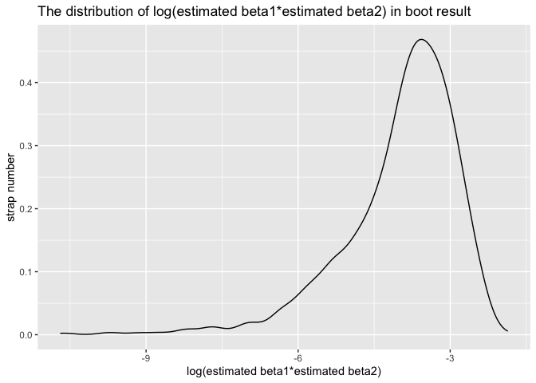

p8105_hw6_zj2379
================
Zheshu Jiang
2023-11-28

# Problem 0

``` r
weather_df = 
  rnoaa::meteo_pull_monitors(
    c("USW00094728"),
    var = c("PRCP", "TMIN", "TMAX"), 
    date_min = "2022-01-01",
    date_max = "2022-12-31") |>
  mutate(
    name = recode(id, USW00094728 = "CentralPark_NY"),
    tmin = tmin / 10,
    tmax = tmax / 10) |>
  select(name, id, everything())
```

    ## using cached file: /Users/jiangzheshu/Library/Caches/org.R-project.R/R/rnoaa/noaa_ghcnd/USW00094728.dly

    ## date created (size, mb): 2023-10-02 00:33:00.465025 (8.525)

    ## file min/max dates: 1869-01-01 / 2023-09-30

# Problem 1

``` r
homicide_df = 
  read_csv("homicide-data.csv", na = c("", "NA", "Unknown")) |> 
  mutate(
    city_state = str_c(city, state, sep = ", "),
    resolution = case_when(
      disposition == "Closed without arrest" ~ 0,
      disposition == "Open/No arrest"        ~ 0,
      disposition == "Closed by arrest"      ~ 1),
    victim_age = as.numeric(victim_age))|>
  filter(victim_race == "Black" | victim_race == "White")|> 
  filter(!(city_state %in% c("Tulsa, AL", "Dallas, TX", "Phoenix, AZ", "Kansas City, MO"))) |> 
  select(city_state, resolution, victim_age, victim_sex, victim_race)
```

    ## Rows: 52179 Columns: 12
    ## ── Column specification ────────────────────────────────────────────────────────
    ## Delimiter: ","
    ## chr (8): uid, victim_last, victim_first, victim_race, victim_sex, city, stat...
    ## dbl (4): reported_date, victim_age, lat, lon
    ## 
    ## ℹ Use `spec()` to retrieve the full column specification for this data.
    ## ℹ Specify the column types or set `show_col_types = FALSE` to quiet this message.

Save the output of glm as an R object; apply the broom::tidy to this
object; and obtain the estimate and confidence interval of the adjusted
odds ratio for solving homicides comparing male victims to female
victims keeping all other variables fixed.

``` r
baltimore_data= homicide_df |> filter(city_state=="Baltimore, MD")|>
  glm(resolution ~ victim_age + victim_sex + victim_race, family = binomial(), data = _)

baltimore_data |> 
  broom::tidy() |> 
  mutate(
    OR = exp(estimate), 
    OR_CI_upper = exp(estimate + 1.96 * std.error),
    OR_CI_lower = exp(estimate - 1.96 * std.error)) |> 
  filter(term == "victim_sexMale") |> 
  select(OR, OR_CI_lower, OR_CI_upper) |>
  knitr::kable(digits = 3)
```

|    OR | OR_CI_lower | OR_CI_upper |
|------:|------------:|------------:|
| 0.426 |       0.325 |       0.558 |

Now run glm for each of the cities in your dataset, and extract the
adjusted odds ratio (and CI) for solving homicides comparing male
victims to female victims. Do this within a “tidy” pipeline, making use
of purrr::map, list columns, and unnest as necessary to create a
dataframe with estimated ORs and CIs for each city.

``` r
model_results = 
  homicide_df |> 
  nest(data = -city_state) |> 
  mutate(
    models = map(data, \(df) glm(resolution ~ victim_age + victim_sex + victim_race, 
                             family = binomial(), data = df)),
    tidy_models = map(models, broom::tidy)) |> 
  select(-models, -data) |> 
  unnest(cols = tidy_models) |> 
  mutate(
    OR = exp(estimate), 
    OR_CI_upper = exp(estimate + 1.96 * std.error),
    OR_CI_lower = exp(estimate - 1.96 * std.error)) |> 
  filter(term == "victim_sexMale") |> 
  select(city_state, OR, OR_CI_lower, OR_CI_upper)

model_results |>
  slice(1:5) |> 
  knitr::kable(digits = 3)
```

| city_state      |    OR | OR_CI_lower | OR_CI_upper |
|:----------------|------:|------------:|------------:|
| Albuquerque, NM | 1.767 |       0.831 |       3.761 |
| Atlanta, GA     | 1.000 |       0.684 |       1.463 |
| Baltimore, MD   | 0.426 |       0.325 |       0.558 |
| Baton Rouge, LA | 0.381 |       0.209 |       0.695 |
| Birmingham, AL  | 0.870 |       0.574 |       1.318 |

``` r
model_results |> 
  mutate(city_state = fct_reorder(city_state, OR)) |> 
  ggplot(aes(x = city_state, y = OR)) + 
  geom_point() + 
  geom_errorbar(aes(ymin = OR_CI_lower, ymax = OR_CI_upper)) + 
  theme(axis.text.x = element_text(angle = 90, hjust = 1))
```

<!-- -->

## Problem 2

``` r
weather_df = 
  rnoaa::meteo_pull_monitors(
    c("USW00094728"),
    var = c("PRCP", "TMIN", "TMAX"), 
    date_min = "2022-01-01",
    date_max = "2022-12-31") |>
  mutate(
    name = recode(id, USW00094728 = "CentralPark_NY"),
    tmin = tmin / 10,
    tmax = tmax / 10) |>
  select(name, id, everything())
```

    ## using cached file: /Users/jiangzheshu/Library/Caches/org.R-project.R/R/rnoaa/noaa_ghcnd/USW00094728.dly

    ## date created (size, mb): 2023-10-02 00:33:00.465025 (8.525)

    ## file min/max dates: 1869-01-01 / 2023-09-30

We’ll focus on a simple linear regression with tmax as the response with
tmin and prcp as the predictors, and are interested in the distribution
of two quantities estimated from these data:

``` r
## construct a simple linear regression 
slr_weather_df <- weather_df |>
  lm(tmax ~ tmin + prcp, data = _) 
# extract the r^2
r_squared= slr_weather_df |>broom::glance()|>pull(r.squared)
# extract the log(estimated beta1 + estimated beta2)
log_product=slr_weather_df |> broom::tidy() |>
  filter(term != "(Intercept)") |>
  summarise(log_product = log(prod(estimate)))
```

    ## Warning: There was 1 warning in `summarise()`.
    ## ℹ In argument: `log_product = log(prod(estimate))`.
    ## Caused by warning in `log()`:
    ## ! NaNs produced

``` r
## bootstrap
boot_sample = function(df) {
   sample_frac(df, replace = TRUE)
}

boot_straps = 
  tibble(strap_number = 1:5000) |> 
   mutate(
    strap_sample = map(strap_number, \(i) boot_sample(weather_df)),
    models = map(strap_sample, \(df) lm(tmax ~ tmin + prcp, data = df)),
    results = map(models, broom::tidy),
    r_squared = map_dbl(models, \(model) summary(model)$r.squared)
  ) |> 
  select(strap_number, results,r_squared) |> 
  unnest(results)

log_product=boot_straps|> 
  filter(term!="(Intercept")|>
  group_by(strap_number)|>
  summarize(estimate_product = prod(estimate))|>
  mutate(log_estimate_product = log(estimate_product))
```

    ## Warning: There was 1 warning in `mutate()`.
    ## ℹ In argument: `log_estimate_product = log(estimate_product)`.
    ## Caused by warning in `log()`:
    ## ! NaNs produced

``` r
r_squared_values=boot_straps|>select(r_squared)
```

``` r
log_product|>
  drop_na()|>
  ggplot(aes(x = log_estimate_product))+
  geom_density()+ xlab("log(estimated beta1*estimated beta2)") +
  ylab("strap number") +
  ggtitle("The distribution of log(estimated beta1*estimated beta2) in boot result")
```

<!-- -->

``` r
r_squared_values|>
  drop_na()|>
  ggplot(aes(x = r_squared))+
  geom_density()+ xlab("r^2") +
  ylab("strap number") +
  ggtitle("The distribution of r^2 in boot result")
```

<!-- -->

``` r
# get the proportion of valid log(estimated beta1*estimated beta2) among 5000
prop_valid_log =
  log_product |> 
  drop_na() 
fraction = nrow(prop_valid_log)/5000
fraction
```

    ## [1] 0.3264

``` r
# construct a CI for log(estimated beta1*estimated beta2)
log_product|>
  pull(log_estimate_product)|>
  quantile(c(0.025, 0.975), na.rm = TRUE)
```

    ##      2.5%     97.5% 
    ## -6.714513 -2.508731

``` r
# construct a CI for r^2
r_squared_values|>
  pull(r_squared)|>
  quantile(c(0.025, 0.975), na.rm = TRUE)
```

    ##      2.5%     97.5% 
    ## 0.8891981 0.9401722

# Problem 3

``` r
birthweight=
  read_csv("birthweight.csv")|>
  mutate(
    across(c(babysex, frace, malform, mrace, parity), as.factor)
  )|>
  drop_na()
```

    ## Rows: 4342 Columns: 20
    ## ── Column specification ────────────────────────────────────────────────────────
    ## Delimiter: ","
    ## dbl (20): babysex, bhead, blength, bwt, delwt, fincome, frace, gaweeks, malf...
    ## 
    ## ℹ Use `spec()` to retrieve the full column specification for this data.
    ## ℹ Specify the column types or set `show_col_types = FALSE` to quiet this message.

Propose a regression model for birthweight. This model may be based on a
hypothesized structure for the factors that underly birthweight, on a
data-driven model-building process, or a combination of the two.
Describe your modeling process and show a plot of model residuals
against fitted values – use add_predictions and add_residuals in making
this plot.

``` r
reg_1=lm(bwt ~ blength + bhead + smoken + wtgain + babysex + delwt + fincome + frace + mheight + momage + mrace + parity + pnumlbw + pnumsga + ppwt +  menarche + gaweeks + smoken, data = birthweight)
summary(reg_1)
```

    ## 
    ## Call:
    ## lm(formula = bwt ~ blength + bhead + smoken + wtgain + babysex + 
    ##     delwt + fincome + frace + mheight + momage + mrace + parity + 
    ##     pnumlbw + pnumsga + ppwt + menarche + gaweeks + smoken, data = birthweight)
    ## 
    ## Residuals:
    ##      Min       1Q   Median       3Q      Max 
    ## -1096.58  -185.09    -3.14   173.09  2344.94 
    ## 
    ## Coefficients: (3 not defined because of singularities)
    ##               Estimate Std. Error t value Pr(>|t|)    
    ## (Intercept) -6074.8681   140.3894 -43.272  < 2e-16 ***
    ## blength        74.9897     2.0218  37.091  < 2e-16 ***
    ## bhead         130.7598     3.4511  37.889  < 2e-16 ***
    ## smoken         -4.8586     0.5869  -8.279  < 2e-16 ***
    ## wtgain          2.7212     0.4328   6.287 3.55e-10 ***
    ## babysex2       28.6081     8.4641   3.380 0.000731 ***
    ## delwt           1.3825     0.2364   5.849 5.30e-09 ***
    ## fincome         0.2921     0.1795   1.627 0.103777    
    ## frace2         14.3898    46.1440   0.312 0.755173    
    ## frace3         21.0638    69.2902   0.304 0.761147    
    ## frace4        -47.1383    44.6739  -1.055 0.291409    
    ## frace8          4.6110    74.0591   0.062 0.950358    
    ## mheight         6.8040     1.8007   3.779 0.000160 ***
    ## momage          0.7772     1.2224   0.636 0.524919    
    ## mrace2       -151.6211    46.0408  -3.293 0.000999 ***
    ## mrace3        -91.9801    71.8852  -1.280 0.200775    
    ## mrace4        -56.6219    45.1314  -1.255 0.209692    
    ## parity1       303.0357   272.8464   1.111 0.266783    
    ## parity3       201.6382   273.2837   0.738 0.460655    
    ## parity6       579.6660   274.2527   2.114 0.034605 *  
    ## pnumlbw             NA         NA      NA       NA    
    ## pnumsga             NA         NA      NA       NA    
    ## ppwt                NA         NA      NA       NA    
    ## menarche       -3.6279     2.8943  -1.253 0.210100    
    ## gaweeks        11.5289     1.4666   7.861 4.77e-15 ***
    ## ---
    ## Signif. codes:  0 '***' 0.001 '**' 0.01 '*' 0.05 '.' 0.1 ' ' 1
    ## 
    ## Residual standard error: 272.5 on 4320 degrees of freedom
    ## Multiple R-squared:  0.7184, Adjusted R-squared:  0.717 
    ## F-statistic: 524.7 on 21 and 4320 DF,  p-value: < 2.2e-16

``` r
birthweight <- birthweight |>
  add_predictions(reg_1, var = "fitted_values") |>
  add_residuals(reg_1, var = "residuals")
```

    ## Warning in predict.lm(model, data): prediction from rank-deficient fit; attr(*,
    ## "non-estim") has doubtful cases

    ## Warning in predict.lm(model, data): prediction from rank-deficient fit; attr(*,
    ## "non-estim") has doubtful cases

``` r
ggplot(birthweight, aes(x = fitted_values, y = residuals)) +
  geom_point() +
  geom_hline(yintercept = 0, color = "red") +
  labs(x = "Fitted Values", y = "Residuals") +
  theme_minimal()
```

<!-- -->
From the plot, the residuals scatter around 0.

``` r
reg_2=lm(bwt ~ blength+ gaweeks, data = birthweight)
summary(reg_2)
```

    ## 
    ## Call:
    ## lm(formula = bwt ~ blength + gaweeks, data = birthweight)
    ## 
    ## Residuals:
    ##     Min      1Q  Median      3Q     Max 
    ## -1709.6  -215.4   -11.4   208.2  4188.8 
    ## 
    ## Coefficients:
    ##              Estimate Std. Error t value Pr(>|t|)    
    ## (Intercept) -4347.667     97.958  -44.38   <2e-16 ***
    ## blength       128.556      1.990   64.60   <2e-16 ***
    ## gaweeks        27.047      1.718   15.74   <2e-16 ***
    ## ---
    ## Signif. codes:  0 '***' 0.001 '**' 0.01 '*' 0.05 '.' 0.1 ' ' 1
    ## 
    ## Residual standard error: 333.2 on 4339 degrees of freedom
    ## Multiple R-squared:  0.5769, Adjusted R-squared:  0.5767 
    ## F-statistic:  2958 on 2 and 4339 DF,  p-value: < 2.2e-16

``` r
reg_3=lm(bwt ~ bhead+ blength+ babysex+ bhead * blength + bhead * babysex + blength * babysex, data = birthweight)
summary(reg_3)
```

    ## 
    ## Call:
    ## lm(formula = bwt ~ bhead + blength + babysex + bhead * blength + 
    ##     bhead * babysex + blength * babysex, data = birthweight)
    ## 
    ## Residuals:
    ##     Min      1Q  Median      3Q     Max 
    ## -1133.8  -189.7    -7.2   178.8  2721.8 
    ## 
    ## Coefficients:
    ##                    Estimate Std. Error t value Pr(>|t|)    
    ## (Intercept)      -3768.3047   859.9205  -4.382  1.2e-05 ***
    ## bhead               79.5055    25.9480   3.064  0.00220 ** 
    ## blength             31.5110    17.8264   1.768  0.07719 .  
    ## babysex2           259.9785   197.9105   1.314  0.18904    
    ## bhead:blength        1.5608     0.5269   2.962  0.00307 ** 
    ## bhead:babysex2     -12.6620     7.0450  -1.797  0.07236 .  
    ## blength:babysex2     4.2107     4.1691   1.010  0.31257    
    ## ---
    ## Signif. codes:  0 '***' 0.001 '**' 0.01 '*' 0.05 '.' 0.1 ' ' 1
    ## 
    ## Residual standard error: 288.1 on 4335 degrees of freedom
    ## Multiple R-squared:  0.6839, Adjusted R-squared:  0.6835 
    ## F-statistic:  1563 on 6 and 4335 DF,  p-value: < 2.2e-16

``` r
cv_df = 
  crossv_mc(birthweight, 100) 

cv_df |> pull(train) |> nth(1) |> as_tibble()
```

    ## # A tibble: 3,473 × 22
    ##    babysex bhead blength   bwt delwt fincome frace gaweeks malform menarche
    ##    <fct>   <dbl>   <dbl> <dbl> <dbl>   <dbl> <fct>   <dbl> <fct>      <dbl>
    ##  1 2          34      51  3629   177      35 1        39.9 0             13
    ##  2 1          34      48  3062   156      65 2        25.9 0             14
    ##  3 2          36      50  3345   148      85 1        39.9 0             12
    ##  4 2          34      52  3374   156       5 1        41.6 0             13
    ##  5 1          33      52  3374   129      55 1        40.7 0             12
    ##  6 2          33      46  2523   126      96 2        40.3 0             14
    ##  7 1          36      52  3515   146      85 1        40.3 0             11
    ##  8 1          33      50  3459   169      75 2        40.7 0             12
    ##  9 2          35      51  3317   130      55 1        43.4 0             13
    ## 10 2          35      48  3175   158      75 1        39.7 0             13
    ## # ℹ 3,463 more rows
    ## # ℹ 12 more variables: mheight <dbl>, momage <dbl>, mrace <fct>, parity <fct>,
    ## #   pnumlbw <dbl>, pnumsga <dbl>, ppbmi <dbl>, ppwt <dbl>, smoken <dbl>,
    ## #   wtgain <dbl>, fitted_values <dbl>, residuals <dbl>

``` r
cv_df |> pull(test) |> nth(1) |> as_tibble()
```

    ## # A tibble: 869 × 22
    ##    babysex bhead blength   bwt delwt fincome frace gaweeks malform menarche
    ##    <fct>   <dbl>   <dbl> <dbl> <dbl>   <dbl> <fct>   <dbl> <fct>      <dbl>
    ##  1 1          34      52  3062   157      55 1        40   0             14
    ##  2 2          33      49  2778   140       5 1        37.4 0             12
    ##  3 1          35      51  3459   146      55 1        39.4 0             12
    ##  4 2          36      52  3629   154      65 1        40.3 0             11
    ##  5 1          34      52  3203   134      25 1        41.1 0             14
    ##  6 1          36      54  3402   161      95 1        40.1 0             11
    ##  7 2          35      53  3600   141      35 1        42.3 0             14
    ##  8 2          34      51  3232   155      55 1        41.6 0             15
    ##  9 1          35      52  3232   121      75 3        42.3 0             13
    ## 10 2          34      49  3317   142      35 1        40.4 0             12
    ## # ℹ 859 more rows
    ## # ℹ 12 more variables: mheight <dbl>, momage <dbl>, mrace <fct>, parity <fct>,
    ## #   pnumlbw <dbl>, pnumsga <dbl>, ppbmi <dbl>, ppwt <dbl>, smoken <dbl>,
    ## #   wtgain <dbl>, fitted_values <dbl>, residuals <dbl>

``` r
cv_df =
  cv_df |> 
  mutate(
    train = map(train, as_tibble),
    test = map(test, as_tibble))

cv_results =
  cv_df |> 
  mutate(
    reg_1 = map(train, \(df) lm(bwt ~ blength + bhead + smoken + wtgain + babysex + delwt + fincome + frace + mheight + momage + mrace + parity + pnumlbw + pnumsga + ppwt +  menarche + gaweeks + smoken, data = birthweight)),
    reg_2 = map(train, \(df) lm(bwt ~ gaweeks + blength, data = birthweight)),
    reg_3 = map(train, \(df) lm(bwt ~ bhead + blength + babysex + bhead * blength + bhead * babysex + blength * babysex, 
             data = birthweight))
  ) |> 
  mutate(
    rmse_reg_1 = map2_dbl(reg_1, test, \(mod, df) rmse(mod, df)),
    rmse_reg_2= map2_dbl(reg_2, test, \(mod, df) rmse(mod, df)),
    rmse_reg_3 = map2_dbl(reg_3, test, \(mod, df) rmse(mod, df))
  )
```

    ## Warning: There were 100 warnings in `mutate()`.
    ## The first warning was:
    ## ℹ In argument: `rmse_reg_1 = map2_dbl(reg_1, test, function(mod, df) rmse(mod,
    ##   df))`.
    ## Caused by warning in `predict.lm()`:
    ## ! prediction from rank-deficient fit; attr(*, "non-estim") has doubtful cases
    ## ℹ Run `dplyr::last_dplyr_warnings()` to see the 99 remaining warnings.

``` r
cv_results |> 
  select(starts_with("rmse")) |> 
  pivot_longer(
    everything(),
    names_to = "model_type",
    values_to = "rmse",
    names_prefix = "rmse_"
  ) |> 
  group_by(model_type) |> 
  summarize(m_rmse = mean(rmse))
```

    ## # A tibble: 3 × 2
    ##   model_type m_rmse
    ##   <chr>       <dbl>
    ## 1 reg_1        271.
    ## 2 reg_2        331.
    ## 3 reg_3        287.

``` r
cv_results |> 
  select(starts_with("rmse")) |> 
  pivot_longer(
    everything(),
    names_to = "model_type",
    values_to = "rmse",
    names_prefix = "rmse_"
  ) |> 
  ggplot(aes(x = model_type, y = rmse)) +
  geom_violin()
```

<!-- -->

Reg_1 might have the best performance in terms of RMSE because its
distribution is lower and tighter, indicating lower and more consistent
errors.
